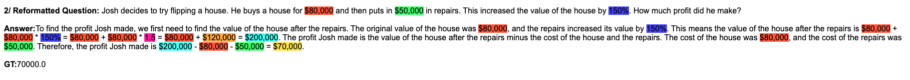

<div align="center">    
 
# HoT: Highlighted Chain of Thought for Referencing Supportive Facts from Inputs
by [Tin Nguyen](https://ngthanhtin.github.io/), [Logan Bolton](), and [Anh Nguyen](https://anhnguyen.me/). 
</div> 

<i>
_**tldr:** An Achilles heel of Large Language Models (LLMs) is their tendency to hallucinate non-factual statements. A response mixed of factual and non-factual statements poses a challenge for humans to verify and accurately base their decisions on. To combat this problem, we propose Highlighted Chain-of-Thought Prompting (HoT), a technique for prompting LLMs to generate responses with XML-tags that ground facts to those provided in the query. That is, given an input question, LLMs would first re-format the question to add XML tags highlighting key facts, and then, generate a response with highlights over the facts referenced from the input. Interestingly, in few-shot settings, HoT **outperforms** the vanilla chain of thoughts (CoT) on a wide range of 17 tasks from arithmetic, reading comprehension to logical reasoning.
</i>

# 1. Requirements
```
python=3.10.15
google-generativeai==0.8.3
openai==1.58.1
```

# 2. How to Run

Run the following command to execute the script:

```bash
python main.py --save_answer --llm_model "$llm_model" --dataset "$dataset" --answer_mode "$run_mode" --data_mode "$data_mode"
```

## Parameters:
- `--llm_model`: Defines the LLM model to use. Choices include:
  - `gemini-1.5-pro-002`, `gemini-1.5-flash-002`,
  - `gpt-4o-2024-08-06`
  - `llama_8b`, `llama_70b`, `llama_sambanova_405b`
  - `qwen25_coder_32b`, `qwq_32b`, `deepseek_r1`
- `--dataset`: Specifies the dataset to evaluate, such as:
  - `GSM8K`, `AQUA`, `DROP`
- `--answer_mode"`: Determines the answering strategy:
  - `cot`: Chain-of-Thought prompting
  - `hot`: Highlight Chain-of-Thought prompting
- `--data_mode`: 
  - `random`: Runs the model on 200 randomly selected samples.
  - `longest`: Runs the model on 200 longest samples.
  - `shortest`: Runs the model on 200 shortest samples.
  - `full`: Runs the model on the whole dataset.

## Example Usage
```bash
python main.py --save_answer --llm_model "gpt-4o-2024-08-06" --dataset "GSM8K" --answer_mode "cot" --data_mode random
```

# 3. How to evaluate the result
Run the following command to evaluate the results:
```bash
python evaluate.py --llm_model "$llm_model" --dataset "$dataset" --answer_mode "$answer_mode" --data_mode "$data_mode"
```

## Example Usage
```bash
python evaluate.py --llm_model "gpt-4o-2024-08-06" --dataset "GSM8K" --answer_mode "cot" --data_mode longest
```

# 4. How to visualize the result
Run the following command to render the result on html pages:
```bash
python visualize.py --llm_model "$llm_model" --dataset "$dataset" --answer_mode "$answer_mode" --save_html
```
## Example Usage
```bash
python visualize.py --llm_model "gpt-4o-2024-08-06" --dataset "GSM8K" --answer_mode "cot" --data_mode --save_html
```



